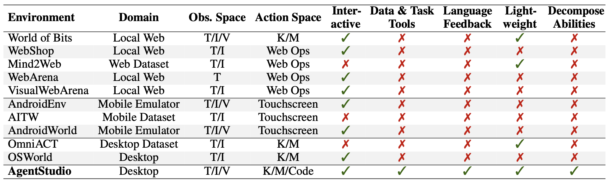
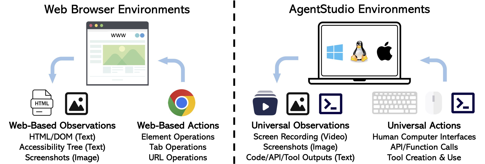
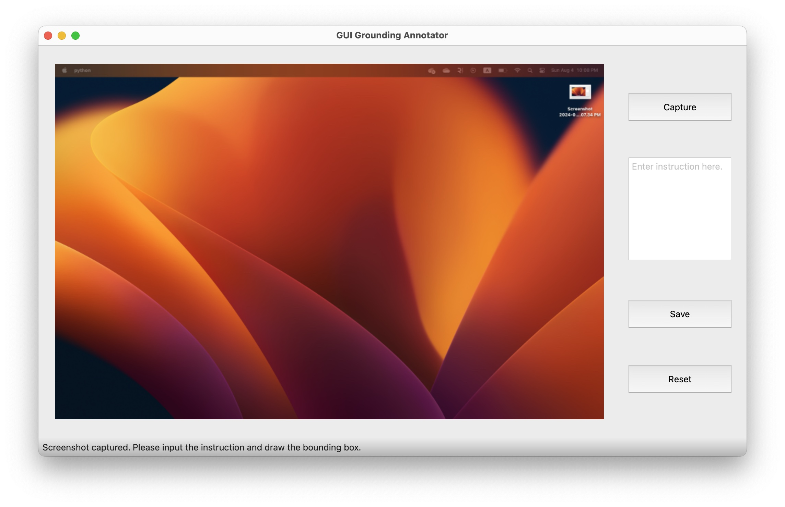

<h1 align="center">
AgentStudio
</h1>

<p align="center">
<!-- <a href='https://arxiv.org/abs/2403.17918'></a> -->
<a href='https://skyworkai.github.io/agent-studio/'></a>
<a href="https://www.python.org/downloads/release/python-3117/"></a>
<a href="https://github.com/psf/black"></a>
<!-- <a href="https://mypy-lang.org/"></a> -->
<a href="https://www.gnu.org/licenses/agpl-3.0"></a>
<a href="https://pre-commit.com/"></a>
</p>

AgentStudio is an **integrated solution for building and benchmarking computer agents**. It features in-depth benchmark suites, realistic environments, and comprehensive toolkits. Here, we open-source everything to promote research towards generalist computer agents of the future. The paper, leaderboard, benchmark suites, and documentation for environments and toolkits can be found in our <a href="https://skyworkai.github.io/agent-studio/"><b>project page</b></a>.


Comparisons with existing work:



## News

**Aug 18, 2024**: We make major update v0.2 to clean up code and datasets.

**Jun 6, 2024**: We update the leaderboard and benchmarks.

**Mar 30, 2024**: We release the beta version of AgentStudio.

## Installation

Install requirements:

```bash
apt-get install gnome-screenshot xclip xdotool  # If using Ubuntu 22.04
conda create --name agent-studio python=3.11 -y
conda activate agent-studio
pip install -e .
```

All confidential API keys should be stored in `agent_studio/config/api_key.json`, e.g., OpenAI API key, Claude API key, Gemini API key, etc. We have provided an example config in `agent_studio/config/api_key_template.json`.

## Benchmarks for Fundamental Agent Abilities

To provide benchmarking focusing on specific agent capabilities that current benchmark is lacking, we release three benchmark suites, targeting robust **UI grounding**, **success detection** (self-reflection), and **learning from unlabeled videos** (inverse dynamics models).

The leaderboard and data can be found at our [project page](https://skyworkai.github.io/agent-studio/). The scripts to produce or add benchmark results can be found [here](evals/README.md).

We curated three static datasets for benchmarking GUI grounding, success detection, and learning from videos, respectively. Please see the detailed [evals/README.md](evals/README.md) for scripts that reproduce the benchmark results in our paper.

## Customize Online Benchmarks in Real Environments



AgentStudio also provides a cross-platform real-world environments with most generic (human-like) observation and action spaces. We also offer a set of example tasks as a demonstration to benchmark computer agents in the wild. We also offer several auto-evaluators for easily benchmark without human evaluation. The implementation is straightforward and flexible, supporting adding custom tasks as well as human evaluation. Please find more in [docs/online_benchmark.md](docs/online_benchmark.md).

## Record GUI Data and Trajectories

The real-world environments also facilitate scalable data collection across different operating systems. AgentStudio offers two data collection pipelines for single-step GUI grounding data and task-completing trajectories, for both local recording (assuming there are two screens) and remote recording (based on VNC). Please refer to the [docs/annotate_ground_ui.md](docs/annotate_ground_ui.md) and [docs/annotate_trajectory.md](docs/annotate_trajectory.md) for detailed instructions.

Here is an example of recording single-step GUI grounding data in MacOS:

<div style="display: flex; justify-content: space-between;">
    
    
</div>

The example video of recording trajectories can be found at our project page.


## Contributing

We are continuing to expand the collection of environments, tasks, and data over time. Contributions and feedback from everyone on how to make this into a better tool are more than welcome. Please check out [CONTRIBUTING.md](CONTRIBUTING.md) for how to get involved.

## Acknowledgement

We would like to thank the following projects for their inspiration and contributions to the open-source community: [Open Interpreter](https://github.com/KillianLucas/open-interpreter), [WebArena](https://github.com/web-arena-x/webarena), [Cradle](https://baai-agents.github.io/Cradle/), [Synapse](https://ltzheng.github.io/Synapse/), [SeeClick](https://github.com/njucckevin/SeeClick), [ScreenAgent](https://github.com/niuzaisheng/ScreenAgent), etc.

## Citation

If you find AgentStudio useful, please cite our [paper](https://arxiv.org/abs/2403.17918):

```bibtex
@article{zheng2024agentstudio,
  title={AgentStudio: A Toolkit for Building General Virtual Agents},
  author={Longtao Zheng and Zhiyuan Huang and Zhenghai Xue and Xinrun Wang and Bo An and Shuicheng Yan},
  journal={arXiv preprint arXiv:2403.17918},
  year={2024}
}
```
