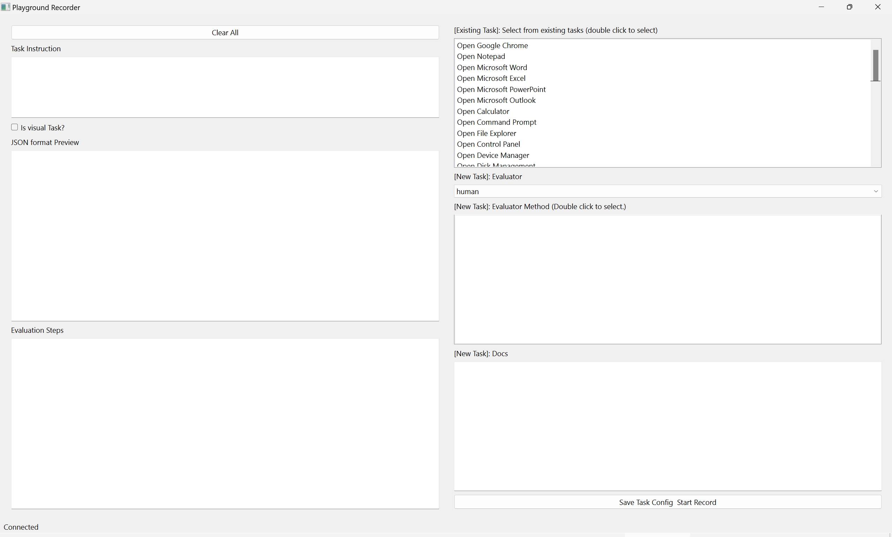
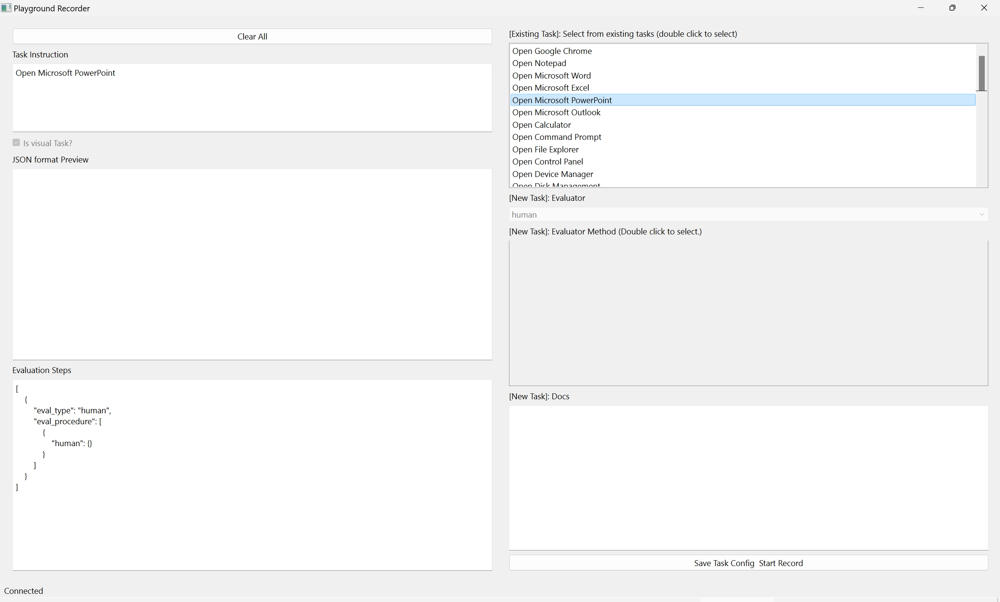
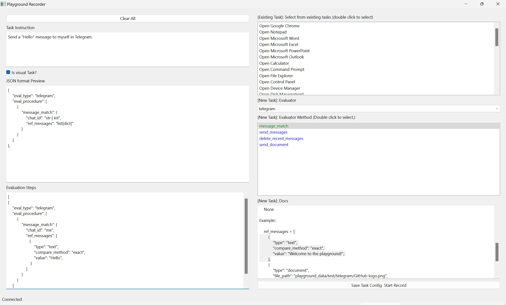
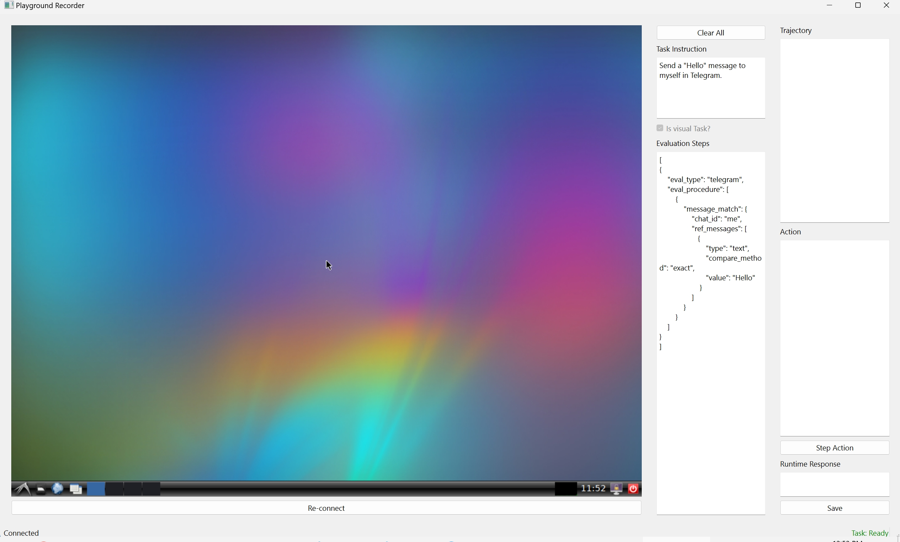

[](https://www.python.org/downloads/release/python-3117/)
<a href="https://github.com/psf/black"></a>
<a href="https://mypy-lang.org/"></a>
[](https://www.gnu.org/licenses/agpl-3.0)
<a href="https://pre-commit.com/"></a>

# AgentStudio

AgentStudio is a holistic and scalable benchmark for measuring and training an AI's general intelligence across the world's supply of games, websites and other applications, in both online desktop and mobile environments. Agents need such a comprehensive and online environment to explore and learn the knowledge of the digital world.

## Contributing

We welcome and value contributions from everyone, no matter the scale. Please check out [CONTRIBUTING.md](./CONTRIBUTING.md) for how to get involved.

## Setup environment

Install requirements:
```bash
apt-get install gnome-screenshot xclip xdotool # If use Ubuntu 22.04
conda create --name agent-studio python=3.11 -y
conda activate agent-studio
pip install -r requirements_{YOUR_SYSTEM_TYPE}.txt
pip install -e .
```

Download dataset (you may need to [configure huggingface and git lfs](https://huggingface.co/docs/hub/en/repositories-getting-started#cloning-repositories)):

```bash
git submodule update --init --remote --recursive
```

### Setup API Keys

#### Google Workspace

[Enable Google APIs, configure OAuth, download the credentials](https://developers.google.com/docs/api/quickstart/python#set_up_your_environment), the credentials should be saved as `credentials.json` in the `agent_studio/config` directory. Or you can modify the `google_credential_path` field [here](agent_studio/config/config.py) to make sure the path matches.

#### Google Calendar

The agent and the evaluator will modify your Google Calendar. For safety, we recommend you create a new Calendar. Obtain the `calendar_id` by following the instructions [here](https://it.umn.edu/services-technologies/how-tos/google-calendar-find-your-google) and modify the `google_calendar_id` parameters [here](agent_studio/config/api_key_template.json).

#### Telegram

The telegram evaluator is based on [Pyrogram](https://docs.pyrogram.org/). Obtain the Telegram API key by following Telegram’s instructions and rules at https://core.telegram.org/api/obtaining_api_id. After obtaining the `api_id` and `api_hash`, modify the `telegram_api_id` and `telegram_api_hash` parameters [here](agent_studio/config/api_key_template.json).

### Setup Docker

After obtaining the API keys and modifying the `api_key_template.json` file to include the keys, rename the `api_key_template.json` to `api_key.json`.
```bash
mv agent_studio/config/api_key_template.json agent_studio/config/api_key.json
```

Some APIs need the user to log in account manually. Run the following command to finish the API keys setup:
```bash
python setup_api_keys.py
```

Build Docker image:
```bash
docker build -f dockerfiles/Dockerfile.ubuntu.amd64 . -t agent-studio:latest
```

## Get Started

### Record Dataset

#### Run Simulator with Docker

```bash
docker run -d -e RESOLUTION=1024x768 -p 5900:5900 -p 8000:8000 -e VNC_PASSWORD=123456 -v /dev/shm:/dev/shm agent-studio:latest
```

#### Recorder Usage

Run the following command to start the recorder:

```bash
python run.py --mode record --env desktop
```

The first screen is a task configuration interface, where you can create a new task or load an existing task. The task configuration interface is shown below:



You can choose to record an existing task or create a new task. The following are the steps to record a task:

+ Record an existing task:
    1. Choose task from the top right list.
    3. Click the "Save Task Config/Start Recording" button to start recording.
    
+ Create & Record new task:
    1. Input the task instruction.
    2. Select the task type (whether is visual task or not).
    3. Select the evaluator from the dropdown list.
    4. Select the evaluator methods from the list table. Single click will display the method description in "Docs" and double click will show the method example JSON snippet in "JSON format preview".
    5. Edit the "Evaluation Steps" input box, which should be a list of steps to evaluate the task. The format should match the "evals" field in task configuration JSON format.
    6. Click the "Save Task Config/Start Recording" button to start recording.
    

The recording interface is shown below:



The recording interface is divided into three parts: the left part is the VNC window, task configuration created in the previous step is displayed in the middle part, and the right part is the "Action" panel. To record a task, you need to perform the following steps:
1. Input actions (currently is Python code) in the "Action" panel.
2. Click the "Step Action" button to execute the actions.
3. See the result in the VNC window and "Runtime Response" panel.
4. Repeat the above steps until the task is completed.
5. Click the "Save" button to save the recording.

---

### Evaluate Agent

#### Run Simulator with Docker

```bash
docker run -d -e RESOLUTION=1024x768 -p 5900:5900 -p 8000:8000 -e VNC_PASSWORD=123456 -v /dev/shm:/dev/shm agent-studio:latest
```

#### Evaluator Configuration

In `agent_studio/config/config.py`, you can modify the corresponding field to configurate the evaluator.

`need_human_confirmation`: enable/disable human confirmation for the evaluator. Default is `True`, which means each action step and reset step needs human confirmation.

`headless`: enable/disable headless mode for the evaluator. Set to `False` to enable GUI mode. Default is CLI mode. **GUI mode will ignore `need_human_confirmation=False`**.

`remote`: where to execute the actions and run the evaluator. Default is `True`, the remote evaluator will execute the actions and run the evaluator in the docker. If set to `False`, the evaluator will execute the actions and run the evaluator in the local machine.


####  Run Evaluator

Run the following command to start the evaluator:
```bash
python run.py --mode eval
```

If you enabled high DPI scaling, and the VNC window is beyond the screen, you may need to set the `QT_AUTO_SCREEN_SCALE_FACTOR` environment variable to `0` to disable high DPI scaling.

## Data

The agent trajectories can be found [here](https://huggingface.co/datasets/agent-studio/agent-studio-data)

## Acknowledgement

- [Open Interpreter](https://github.com/KillianLucas/open-interpreter)
- [WebArena](https://github.com/web-arena-x/webarena)
- [Cradle](https://baai-agents.github.io/Cradle/)
- [ScreenAgent](https://github.com/niuzaisheng/ScreenAgent)
