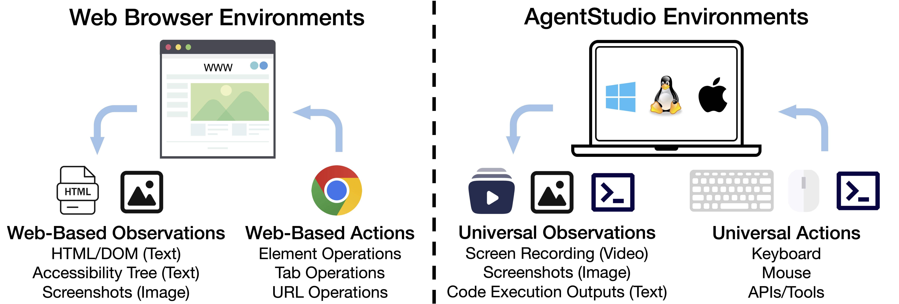

<h1 align="center">
AgentStudio
</h1>

<p align="center">
<a href='https://arxiv.org/abs/2403.17918'></a>
<a href='https://computer-agents.github.io/agent-studio'></a>
<a href="https://www.python.org/downloads/release/python-3117/"></a>
<a href="https://github.com/psf/black"></a>
<!-- <a href="https://mypy-lang.org/"></a> -->
<a href="https://www.gnu.org/licenses/agpl-3.0"></a>
<a href="https://pre-commit.com/"></a>
</p>


AgentStudio is **a trinity of environments, tools, and benchmarks** for general virtual agents to interact with any computer software. AgentStudio targets the desiderata for robust, general, and open-ended virtual agents by providing:
1. **A lightweight, interactive environment** with highly **generic observation and action spaces**, e.g., video observations and GUI/API actions
2. **Tools for creating online benchmark tasks, annotating GUI elements, and labeling actions in videos**
3. **Online benchmark tasks** that evaluate both GUI interactions and function calling with **auto-evaluation** and language feedback
4. **Three benchmark datasets**: GroundUI, IDMBench, and CriticBench, for fundamental agent abilities, including GUI grounding, learning from videos, and success detection


Comparisons with existing work:


## News

- **Oct 3, 2024**: Released the <a href='https://arxiv.org/abs/2403.17918'>arXiv paper v2</a> and a full version of AgentStudio, including comprehensive documentation, complete tasks, and datasets!!
- **Aug 18, 2024**: Major update to clean up the codebase and datasets.
- **Mar 30, 2024**: Released the beta version of AgentStudio.

## Installation

Install requirements:

```bash
apt-get install gnome-screenshot xclip xdotool  # If using Ubuntu 22.04
conda create --name agent-studio python=3.11 -y
conda activate agent-studio
pip install -e '.[client]'
```

All confidential API keys should be stored in `agent_studio/config/api_key.json`, e.g., OpenAI API key, Claude API key, Gemini API key, etc. We have provided an example config in `agent_studio/config/api_key_template.json`.

## AgentStudio Overall Benchmark Tasks



AgentStudio provides the most generic observation and action spaces, which significantly expands the task space, allowing for developing and evaluating agents in real-world settings. We introduce a benchmark suite consisting of 205 tasks. These tasks span API usages such as terminal and Gmail and GUI software like VS Code. Please find more in [eval_online_benchmarks/README.md](eval_online_benchmarks/README.md). The task-related files are available at our <a href='https://computer-agents.github.io/agent-studio'>project page</a>.

## AgentStudio Datasets Decompose Agent Abilities

To gain deeper insights into agent capabilities beyond the overall performance measured by online benchmark tasks, we develop three datasets using AgentStudio: GroundUI, IDMBench, and CriticBench. These datasets target general UI grounding, learning from videos, and success detection. More details are provided in [eval_agent_desiderata/README.md](eval_agent_desiderata/README.md). All data are available at our <a href='https://computer-agents.github.io/agent-studio'>project page</a>.

## AgentStudio Tools

To facilitate the development and evaluation of agents within the AgentStudio environment, we provide three tools for:
- Benchmark task creation and validation
- Step-level GUI element annotation
- Trajectory-level video-action recording and refinement

These tools, combined with the realistic environment of AgentStudio, contribute to the generation of rich, structured data for training and evaluating agents. Please refer to [docs/annotate_ground_ui.md](docs/annotate_ground_ui.md) for the GUI annotation tool, [agent_studio/recorder/README.md](agent_studio/recorder/README.md) for the video-action annotation tool, and [eval_online_benchmarks/README.md](eval_online_benchmarks/README.md) for the task creation/validation.

## Contributing

Contributions and feedback from everyone on how to make this into a better tool are more than welcome. Please check out [CONTRIBUTING.md](CONTRIBUTING.md) for how to get involved.

## Acknowledgement

We would like to thank the following projects for their inspiration and contributions to the open-source community: [Open Interpreter](https://github.com/KillianLucas/open-interpreter), [WebArena](https://github.com/web-arena-x/webarena), [Cradle](https://baai-agents.github.io/Cradle/), [Synapse](https://ltzheng.github.io/Synapse/), [SeeClick](https://github.com/njucckevin/SeeClick), [ScreenAgent](https://github.com/niuzaisheng/ScreenAgent), [OSWorld](https://github.com/xlang-ai/OSWorld), etc.

## Citation

If you find AgentStudio useful, please cite our paper:

```bibtex
@article{zheng2024agentstudio,
  title={AgentStudio: A Toolkit for Building General Virtual Agents},
  author={Longtao Zheng and Zhiyuan Huang and Zhenghai Xue and Xinrun Wang and Bo An and Shuicheng Yan},
  journal={arXiv preprint arXiv:2403.17918},
  year={2024}
}
```
