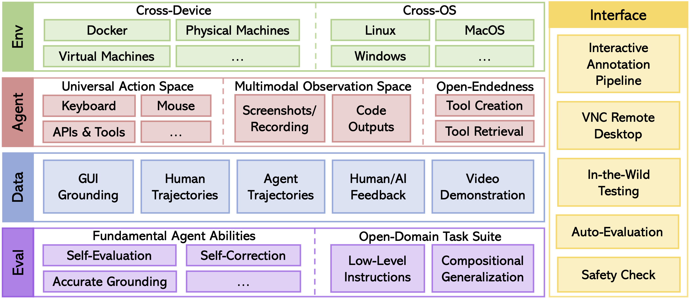

<h1 align="center">
AgentStudio
</h1>

<p align="center">
<a href="https://ltzheng.github.io/agent-studio/"><b>Documentation</b></a>
</p>

<p align="center">
<a href="https://www.python.org/downloads/release/python-3117/"></a>
<a href="https://github.com/psf/black"></a>
<a href="https://mypy-lang.org/"></a>
<a href="https://www.gnu.org/licenses/agpl-3.0"></a>
<a href="https://pre-commit.com/"></a>
</p>

AgentStudio is an open toolkit covering the entire lifespan of
building virtual agents that can interact with everything on digital worlds. Here, we open-source the beta of environment implementations, benchmark suite, data collection pipeline, and graphical interfaces to promote research towards generalist virtual agents of the future.

## Contributing

We plan to expand the collection of environments, tasks, and data over time. Contributions and feedback from everyone on how to make this into a better tool are more than welcome, no matter the scale. Please check out [CONTRIBUTING.md](CONTRIBUTING.md) for how to get involved.




## Evaluation on GUI Grounding Dataset

```bash
python eval_dataset.py --start_idx 0 --end_idx 1 --data_path data/grounding/windows/powerpoint/actions.jsonl --provider gpt-4-vision-preview
```

## Quickstart

### Setup Environment

Install requirements:
```bash
apt-get install gnome-screenshot xclip xdotool  # If using Ubuntu 22.04
conda create --name agent-studio python=3.11 -y
conda activate agent-studio
pip install -r requirements_{YOUR_SYSTEM_TYPE}.txt
pip install -e .
```

This command will download the task suite and agent trajectories from [Huggingface](https://huggingface.co/datasets/agent-studio/agent-studio-data) (you may need to [configure huggingface and git lfs](https://huggingface.co/docs/hub/en/repositories-getting-started#cloning-repositories)).

```bash
git submodule update --init --remote --recursive
```

### Setup API Keys

Please refer to the [doc](docs/source/getting_started/setup_api_keys.rst) for detailed instructions.

### Setup Docker

This step is optional, only for running tasks with GUI in a docker container.

Build Docker image:
```bash
docker build -f dockerfiles/Dockerfile.ubuntu.amd64 . -t agent-studio:latest
```

## Evaluate Agents

You may modify [config.py](agent_studio/config/config.py) to configure the environment.

- `headless`: Set to `False` for GUI mode or `True` for CLI mode.
- `remote`: Set to `True` for running experiments in the docker or remote machines. Otherwise, experiments will run locally.
- `task_config_paths`: The path to the task configuration file.

### Local + Headless

Set `headless = True` and `remote = False`. This setup is the simplest, and it is suitable for evaluating agents that do not require GUI (e.g., Google APIs).

Start benchmarking:

```bash
python run.py --mode eval
```

### Remote + GUI

Set `headless = False` and `remote = True`. This setup is suitable for evaluating agents in visual tasks. The remote machines can either be a docker container or a remote machine, connected via VNC remote desktop.

#### Run Docker (optional)
```bash
docker run -d -e RESOLUTION=1024x768 -p 5900:5900 -p 8000:8000 -e VNC_PASSWORD=123456 -v /dev/shm:/dev/shm -v ${PWD}/agent_studio/config/:/home/ubuntu/agent_studio/agent_studio/config/:ro -v ${PWD}/data:/home/ubuntu/agent_studio/data:ro agent-studio:latest
```

Start benchmarking:

```bash
python run.py --mode eval
```

## Record Datasets, Add Tasks & More

Please refer to the our [documentation](https://ltzheng.github.io/agent-studio/) for detailed instructions on environment setup, running experiments, recording dataset, adding new tasks, and troubleshooting.

Here is an example of recording human demonstrations:


## Annotator

We provide a simple annotator for GUI grounding data. Please refer to the [doc](docs/source/getting_started/annotation.rst) for detailed instructions.

## Acknowledgement

We would like to thank the following projects for their inspiration and contributions to the open-source community:

- [Open Interpreter](https://github.com/KillianLucas/open-interpreter)
- [WebArena](https://github.com/web-arena-x/webarena)
- [Cradle](https://baai-agents.github.io/Cradle/)
- [ScreenAgent](https://github.com/niuzaisheng/ScreenAgent)
