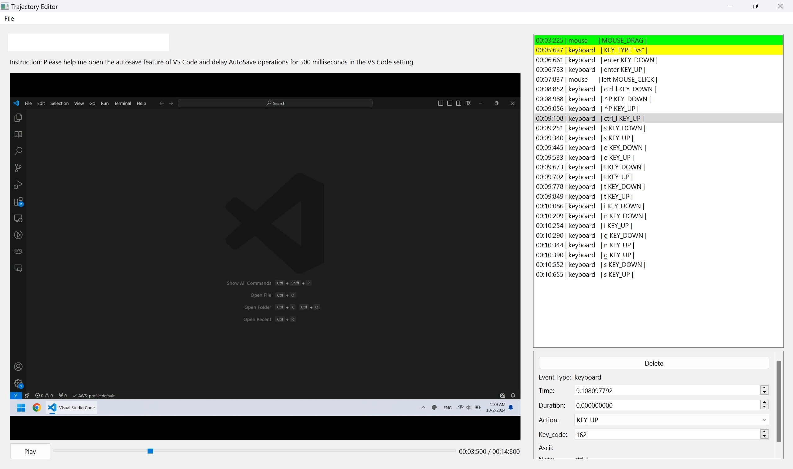

## CLI Trajectory Recorder

1. Run the following command to start the trajectory recorder:
    ```bash
    as-traj-recorder
    ```
2. Input the record path
3. Input task instruction
4. Count down for 5 seconds, you can start operating after hearing a chime.
5. Use `Ctrl+Shift+o` to stop the recorder.

## Trajectory Editor for Video Refining



1. Run
    ```bash
    as-traj-editor
    ```
2. Navigate to `File -> Open` to open a `record.json` file

## Troubleshoot

- `mss.exception.ScreenShotError: XGetImage() failed`

    Gnome using Wayland instead of Xorg as the default video output and Wayland doesn't support screenshot (<https://github.com/python-pillow/Pillow/issues/6312>). Change the Wayland to Xorg will solve this problem. Follow the following steps:

    1. Modifying /etc/gdm3/custom.conf to uncomment #WaylandEnable=false
    2. Ran sudo systemctl restart gdm3 to restart it so Ubuntu is using X instead of Wayland.
    <https://github.com/python-pillow/Pillow/issues/5130>

- `symbol lookup error: /snap/core20/current/lib/x86_64-linux-gnu/libpthread.so.0: undefined symbol: __libc_pthread_init, version GLIBC_PRIVATE`

    VSCode environment issue. Use `unset GTK_PATH` in VSCode integrated terminal (<https://github.com/ros2/ros2/issues/1406>).
