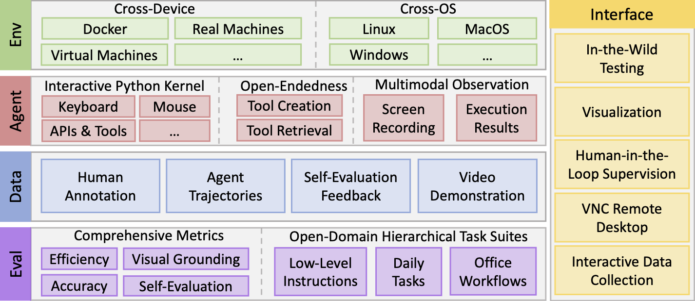
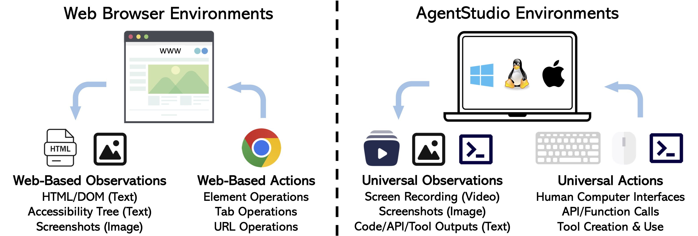
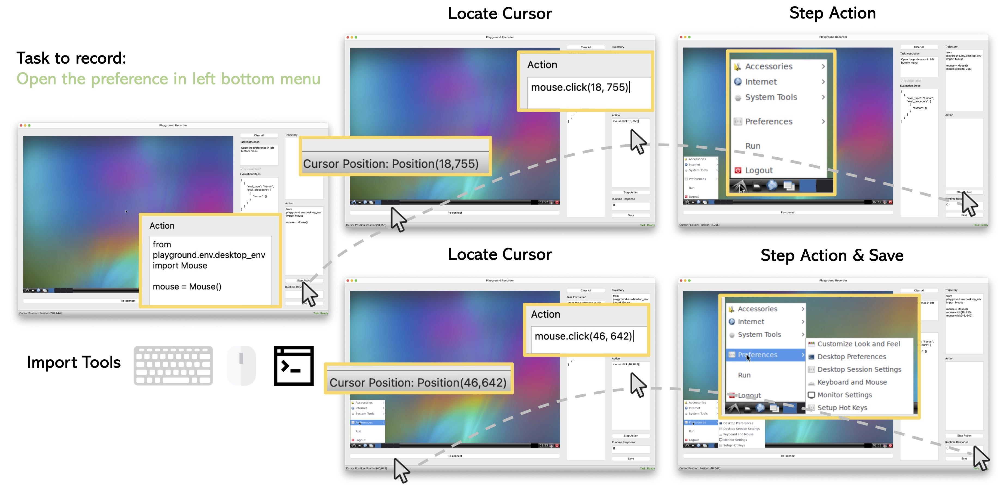

Welcome to AgentStudio!
======================================

.. _Paper: https://arxiv.org/abs/2403.17918
.. _Leaderboard: https://huggingface.co/spaces/Skywork/agent-studio-leaderboard
.. _Dataset & Benchmark: https://huggingface.co/datasets/Skywork/agent-studio-data

`Paper`_ | `Leaderboard`_ | `Dataset & Benchmark`_

.. image:: https://img.shields.io/badge/python-3.11-blue.svg
    :target: https://www.python.org/downloads/release/python-3117/
    :alt: Python 3.11

.. image:: https://img.shields.io/badge/code%20style-black-000000.svg
    :target: https://github.com/psf/black
    :alt: Code style: black

.. image:: https://www.mypy-lang.org/static/mypy_badge.svg
    :target: https://mypy-lang.org/
    :alt: Checked with mypy

.. image:: https://img.shields.io/badge/License-AGPL%20v3-blue.svg
    :target: https://www.gnu.org/licenses/agpl-3.0
    :alt: License: AGPL v3

.. image:: https://img.shields.io/badge/pre--commit-enabled-brightgreen?logo=pre-commit&logoColor=white
    :target: https://pre-commit.com/
    :alt: pre-commit

AgentStudio is an open toolkit covering the entire lifespan of
building virtual agents that can interact with everything on digital worlds. Here, we open-source the beta of environment implementations, benchmark suite, data collection pipeline, and graphical interfaces to promote research towards generalist virtual agents of the future.

AgentStudio provides unified observation and action spaces aligned with how humans interact with computers, allowing agent evaluation and data collection on any human-performed task. This feature drastically expands the potential task space. Therefore, AgentStudio can facilitate the development and benchmark of agents that generalize across diverse real-world use cases. In comparison, most previous environments tailored the observation and action spaces solely for specific domains, such as web operations or API calls.

Contributing
------------

We plan to expand the collection of environments, tasks, and data over time. Contributions and feedback from everyone on how to make this into a better tool are more than welcome, no matter the scale. Please check out `CONTRIBUTING.md`_ for how to get involved.

.. _`CONTRIBUTING.md`: CONTRIBUTING.md

.. toctree::
   :maxdepth: 4

   getting_started/installation

   getting_started/setup_api_keys

   getting_started/evaluate_agents

   getting_started/create_agents

   getting_started/connect_model

   getting_started/upload_results

   getting_started/start_recording

   getting_started/annotation

   getting_started/troubleshooting
